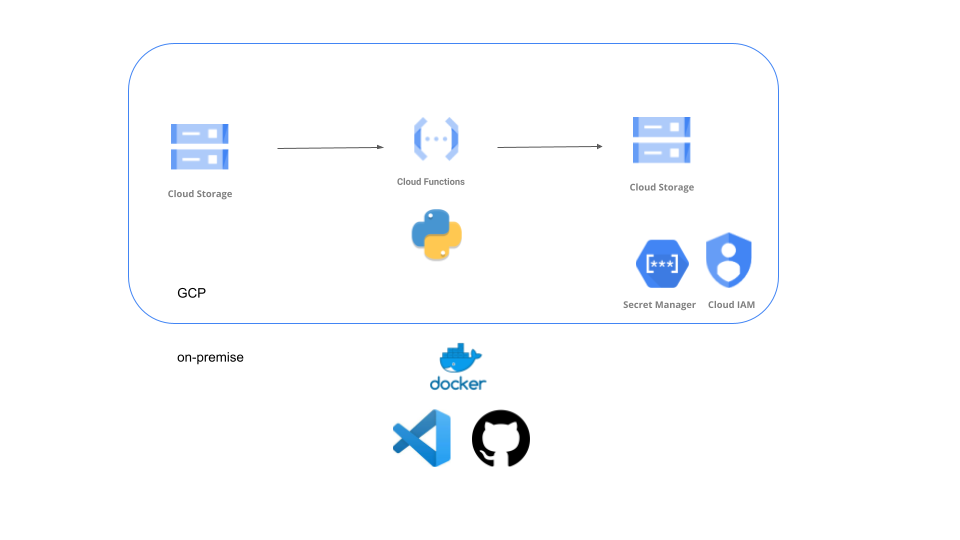

# test-de-mdp-gcf

# Tabla de Contenido

1. [Resumen](#resumen)
2. [Arquitectura](#resumen)
3. [Fuentes](#fuentes)
4. [Ejecución](#ejecucion)

## Resumen

[(Volver al Inicio)](#tabla-de-contenido)

Este proceso se encarga de dividir un archivo desde el bucket **input** y para cada archivo de acuerdo a cada pais se inerta en el bucket **output** 

## Arquitectura

[(Volver al Inicio)](#tabla-de-contenido)

De forma automática cuando nueva data se deposita en el bucket hay una cloud function que hace un preprocesamiento de esta data en python para finalmente dividir esta data en partes (de acuerdo a cada pais) y cada uno se coloca en el bucket resultante

  
   

## Fuentes

[(Volver al Inicio)](#tabla-de-contenido)

Es una sola fuente: GlobalLandTemperaturesByCity.csv

## Ejecución

[(Volver al Inicio)](#ejecucion)

Para ejecutar de forma manual la extracción de las fuentes ya mencionadas para que sean depositadas en nuestros buckets se tiene que setear las variables del sa y de los buckets  **env.yml** y luego ejecutar el comando make-local que está en el **makefile**, primero para probar de forma local con el docker y luego de ver que todo funciona bien usar el comando make-gcf para deployar la cloud function en gcp